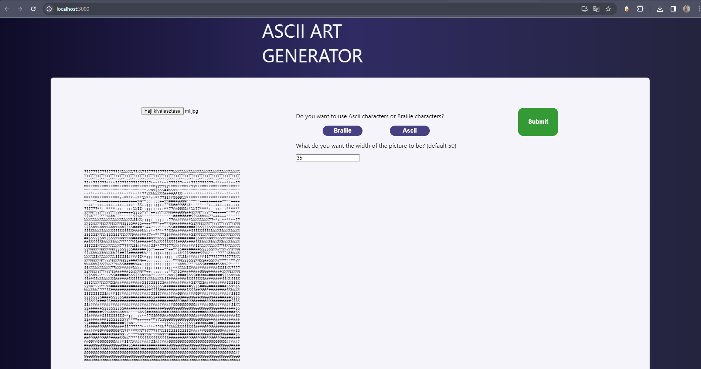

About this project:
    I created this project primarily to get familiar with python synatx. It's an ascii art generator, you need to select an image file and input the number of characters your ascii string's width should be and then it returns your image as a string created by either braille characters or ascii characters ("@", "#", "$", "%", "?", "*", "+", ";", ":", ",", ".").

How to install:

    Clone Repository:
        Clone this repository to your local machine.

    Navigate to Project Folder:
        Open the project folder in your preferred Integrated Development Environment (IDE).

    Install Dependencies:
        In the terminal navigate to the backend folder, run the following command to install backend dependencies:

        ``` pip install -r requirements.txt ```

        This command installs the necessary modules and their dependencies specified in the requirements.txt file.

        In the terminal navigate to the frontend folder, run the following command to install backend dependencies:

        ``` npm install ```

        This command installs the necessary modules and their dependencies specified in the package.json file.

How to start the application:

        In the terminal navigate to the backend folder, run the following command:

        ``` flask --app main run ```

        In another terminal navigate to the frontend folder, run the following command:

        ``` npm start ```

        Open your preferred web browser and go to :

        ``` localhost:3000 ```

Picture of the website:

        
